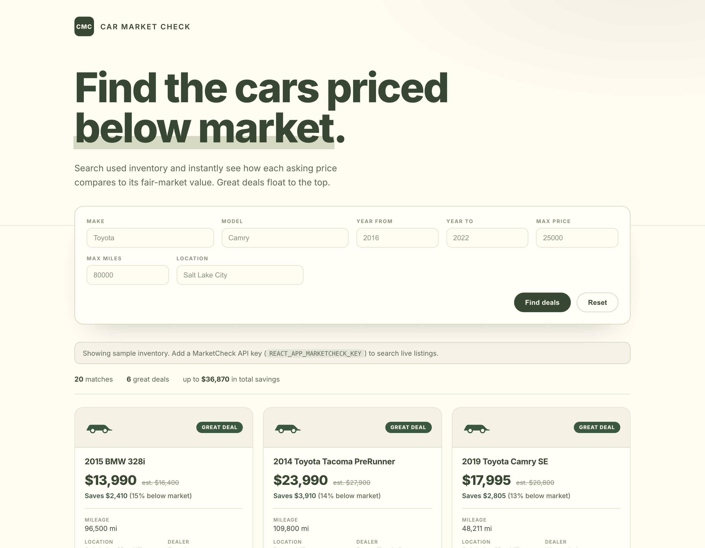

# Car Market Check

https://car-market-check.vercel.app

Search used-car inventory and instantly see how each asking price compares to a
fair-market estimate. Deals are scored and the best ones float to the top.



## What it does

- **Uses your location** (browser geolocation) to pull live used-car listings
  nearby, within a radius you choose.
- **Search** by make, model, year range, max price, max miles, and radius.
- **Deal scoring** compares each asking price to a fair-market estimate and
  labels it Great deal / Good deal / Fair price / Above market, with the dollar
  and percentage savings.
- **Sorted by value** so the strongest deals appear first, with summary stats.

## Live data (API key required)

Listings come from the live [MarketCheck API](https://www.marketcheck.com/apis).
Add your key so the app can search:

```
# .env (local) or an environment variable on the host
REACT_APP_MARKETCHECK_KEY=your_key_here
```

Without a key, the app shows a clear "connect live inventory" state instead of
any placeholder data. Location is requested in the browser; if it's declined,
search falls back to a nationwide query.

## Develop

```bash
npm install
npm start        # http://localhost:3000
npm run build    # production build
```

## Tech

- React 18 (functional components + hooks)
- Create React App (react-scripts 5)
- axios for API calls

## Structure

```
src/
  App.js                 # layout, state, search orchestration
  components/
    SearchBar.js         # filter form
    CarCard.js           # deal-scored car card
    DealBadge.js         # Great/Good/Fair/Above-market badge
  lib/
    geo.js               # browser geolocation + reverse geocode
    marketcheck.js       # live MarketCheck API search (no fallback)
    deal.js              # deal scoring + formatting
```

Originally a 2023 learning project; rebuilt in 2026 with a working search, a deal
engine, and a modern UI.
